# Play.com - eCommerce Store

**IMPORTANT**: *This README and the play-store project as a whole is a work-in-progress and is not completed until this notice 
has been removed.*

**Developer: Samuel Masters**

💻 [Visit live website](https://play-store-samuel-masters.herokuapp.com/)

## Table of Contents
  - [About](#about)
  - [User Goals](#user-goals)
  - [Site Owner Goals](#site-owner-goals)
  - [User Experience](#user-experience)
  - [User Stories](#user-stories)
  - [Design](#design)
    - [Colours](#colours)
    - [Fonts](#fonts)
    - [Structure](#structure)
      - [Website pages](#website-pages)
      - [Database](#database)
    - [Wireframes](#wireframes)
  - [Technologies Used](#technologies-used)
  - [Features](#features)
  - [Validation](#validation)
  - [Testing](#testing)
  - [Bugs](#bugs)
  - [Configuration](#configuration)
    - [Heroku Deployment](#heroku-deployment)
  - [Credits](#credits)

### About

This project, "play-store", is an eCommerce web application where users can browse video game and board game products, add them to a basket, and purchase them via Stripe payments. Users are also able to sign up to a "dummy" newsletter, and can submit contact queries. Site owners / admin have full CRUD functionality with the products listed on the site, and can add, edit, and delete products from the front-end. 

### User Goals

- Be able to browse the site to look for products I may be interested in purchasing. 
- Be able to easily purchase those products. 
- Be able to read and leave reviews for others to see to help get or provide opinions on a product.

### Site Owner Goals

- Be able to easily create new products to list on the store. 
- Be able to easily edit or delete existing products from the store. 

## User Experience

### Target Audience

- People of all ages who have an interest in gaming, or those who are interested in purchasing gaming products for someone else. 

### User Requirements and Expectations

- Simple, easily understandable navigation
- Full CRUD functionality

##### Back to [top](#table-of-contents)

## User Stories

User stories were created at project start and were arranged planned out using Lucidchart. They were then copied over into Github Issues and setup on a project board with MoSCoW prioritisation labels applied. 

User Story Planning

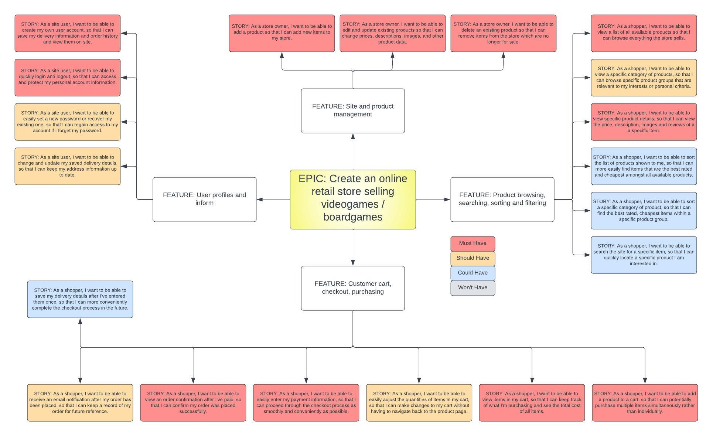

GitHub Issues

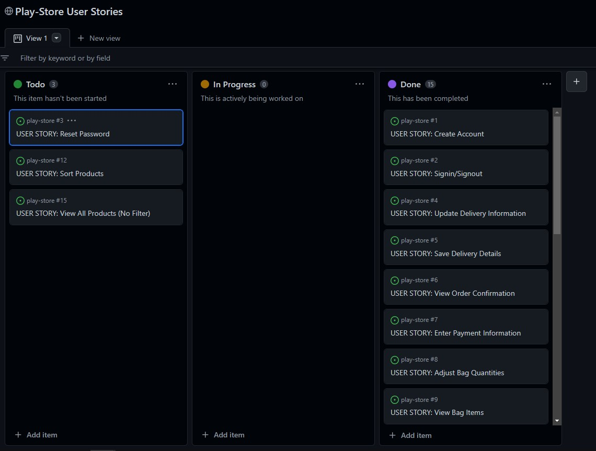

### Users / Shoppers

1.	As a site user, I can create my own user account so that I can save my delivery information and order history and view them on site. (**Must Have**)
2. As a site user, I can quickly login and logout so that I can access and protect my personal account information. (**Must Have**)
3. As a site user, I can easily set a new password or recover an existing one so that I can regain access to my account if I forget my password. (**Could Have**)
4. As a site user, I can edit and update my saved delivery details so that I can keep my address information up to date. (**Could Have**)
5. As a shopper, I can save my delivery details at checkout so that I can more conveniently complete the checkout process in the future. (**Could Have**)
6. As a shopper, I can view an order confirmation after I've paid so that I can confirm my order was placed successfully. (**Must Have**)
7. As a shopper, I can easily enter my payment information so that I can proceed through the checkout process as smoothly and conveniently as possible. (**Must Have**)
8. As a shopper, I can easily adjust the quantities of items in my cart so that I can make changes to my cart without having to navigate back to the product page. (**Should Have**)
9. As a shopper, I can view items in my cart so that I can keep track of what I'm purchasing and see the total cost of all items I've added to my bag. (**Must Have**)
10. As a shopper, I can add a product to my bag so that I have the option to purchase multiple items simultaneously rather than individually. (**Must Have**)
11. As a shopper, I can search the site for a specific item so that I can quickly locate a specific product I'm interested in. (**Should Have**)
12. As a shopper, I can sort a specific category of product so that I can find the best rated and/or cheapest items within a specific product group. (**Could Have**)
13. As a shopper, I can filter the list of available products so that avoid browsing items in categories I'm not interested in. (**Could Have**)
14. As a shopper, I can view specific product details so that I can understand and see specific, relevant product details such as price, description, images and reviews. (**Must Have**)
15. As a shopper, I can view a list of every available product so that I can browse the entire website's selection of products at once.(**Won't Have**)

### Site Owner
16. As a store owner, I can delete existing products so that I can remove items from the store which are no longer for sale. (**Must Have**)
17. As a store owner, I can edit and update existing products so that I can change their prices, descriptions, images and other product data. (**Must Have**)
18. As a store owner, I can create new products so that add new items to sell on the website. (**Must Have**)

##### Back to [top](#table-of-contents)

## Design

### Colours

The colour scheme uses light, mild colouring to help provide contrast against the dark text used on the site. 

### Fonts

Google Fonts was used to provide the font for the website. [Barlow](https://fonts.google.com/specimen/Barlow?preview.text=Your%20one%20stop%20shop%20for%20the%20best%20deals.&preview.text_type=custom) was chosen for it's simplicity and clean lines.

### Structure

#### Website Pages

The website uses different templates / pages to comprise it's structure.

The top of each page features a simple navbar showing the site's "Play.com" logo (which also acts as a home button), along with dynamic authentication links which change depending on whether or not the user is logged in. Also included are links to a profile page, which shows an authenticated user their saved delivery information (if they have any) as well as a basic order history which they can interact with to view past order confirmations. Finally, a bag icon is included which dynamically changes to show the current total value of items a user has in their bag, and clicking this icon leads a user towards checkout. 

The bottom of each page features a simple footer with multiple links. 
- "Contact Us" takes the user to a page where they can fill in a form to send a general query to the site admin. 
- "Privacy Policy" takes the user to a page where the application's privacy policy is detailed in full.
- "Newsletter" takes the user to a page where they can enter their email address to signup to a newsletter (an real email is sent upon submitting here).
- "Facebook" is a dummy social media link which opens Facebook's home page in another tab, but in a real eCommerce application, this would point to the site's business page.

- The website consists of the following sections:
  - Products
  - Product Detail
  - Bag
  - Checkout
  - Authentication (Sign In, Signup, Sign Out)

#### Database

Data for this project is stored is an ElephantSQL postgres database. Data models were planned in advance using Lucidchart. Final implementation of the application's models differ from the initial plans shown here, however the process of planning which models might be required and how they might be comprised was helpful in the initial setup stages.

Model Planning

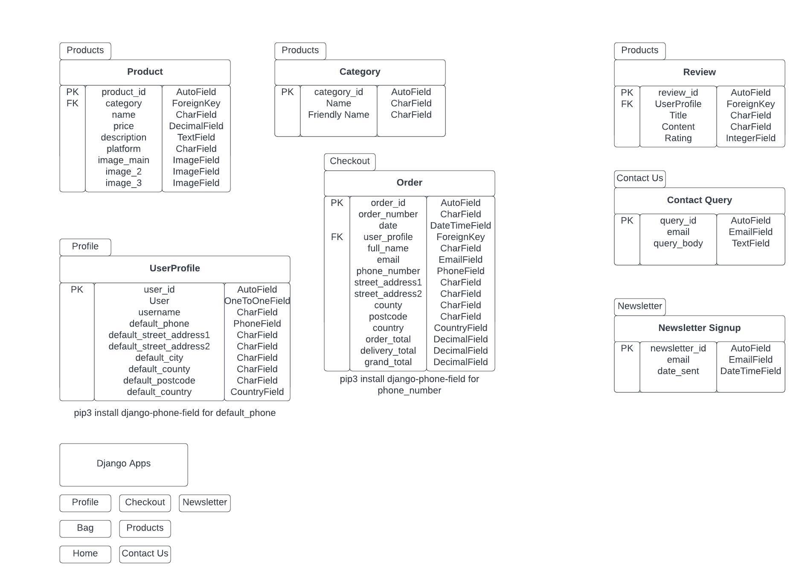

The following models were setup for this project:

##### Order Model
- This model contains information about an individual order placed successfully on site.
- It contains the following fields:
  - order_number
  - user_profile (ForeignKey association to UserProfile model)
  - date
  - full_name
  - email
  - phone_number
  - street_address1
  - street_address2
  - county
  - postcode
  - country
  - order_total

##### OrderLineItem
- This model represents a single item within an instance of the order model.
- It contains the following fields:
  - order (ForeignKey association to Order model)
  - product (ForeignKey association to Product model)
  - quantity
  - lineitem_total

##### ContactQuery
- This model represents a submitted user query from the Contact Us page.
- It contains the following fields:
  - subject
  - first_name
  - last_name
  - email
  - date
  - query_body

##### Subscriber
- This model represents any user who has provided an email address to the newsletter signup page.
- It contains the following fields:
  - email
  - confirmation_key
  - consent
  - signup_date

##### Category
- This model represents different potential product types for which products may be associated against. 
- It contains the following fields:
  - category_name
  - friendly_name

##### Product
- This model represents an item to be listed and available for purchase on the site.
- It contains the following fields:
  - category (ForeignKey association to Category)
  - name
  - price
  - description
  - platform
  - image_main
  - image_2
  - image_3

##### ProductReview
- This model represents a user-submitted review of an item on site.
- It contains the following fields:
  - product (ForeignKey association to Product)
  - reviewer (ForeignKey association to User, a Django authentication model)
  - review_title
  - review_body
  - rating
  - date

##### UserProfile
- This model represents a user's saved information.
- It contains the following fields:
  - user (OneToOne association with User, a Django authentication model)
  - default_phone_number
  - default_street_address1
  - default_street_address2
  - default_postcode
  - default_county
  - default_country

### Wireframes

Home

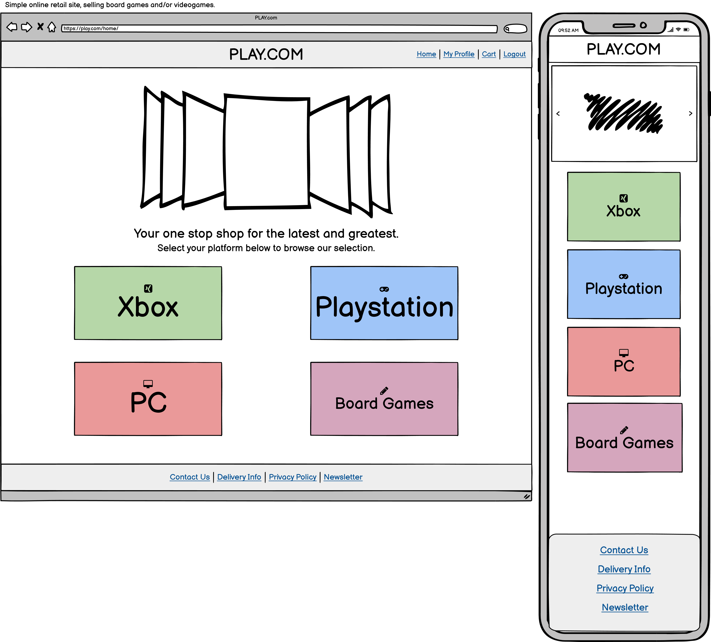

Browse

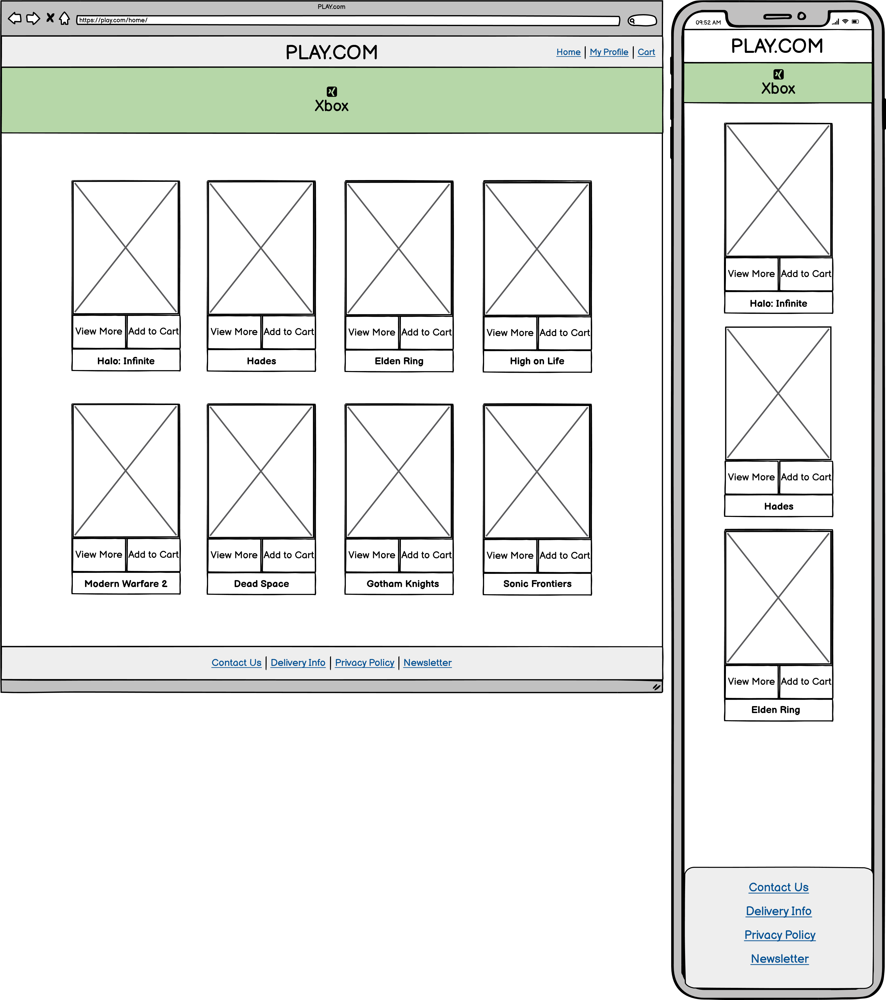

Product Detail

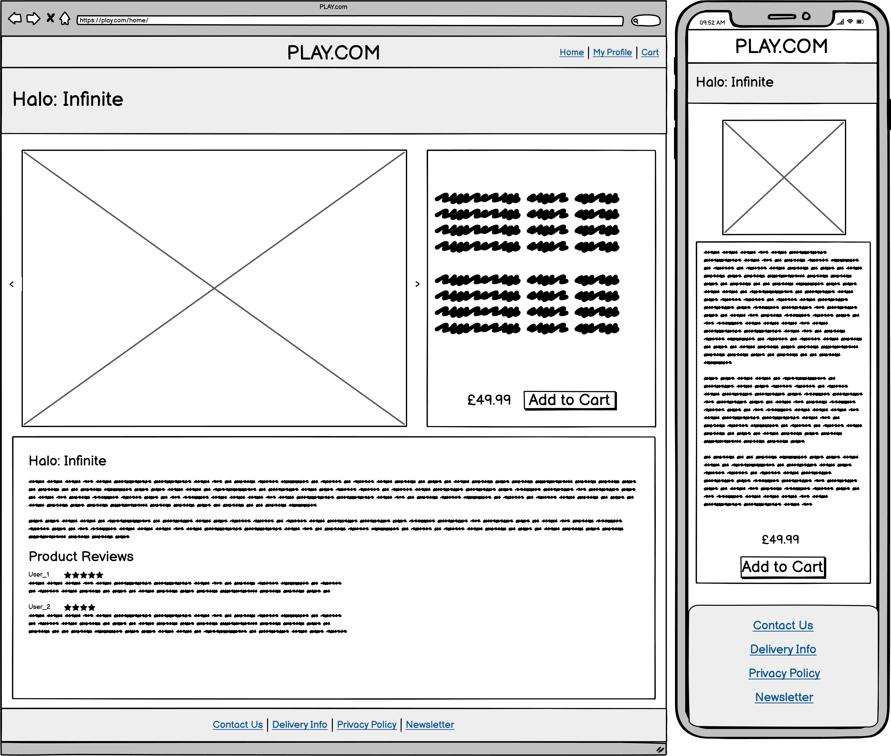

Bag

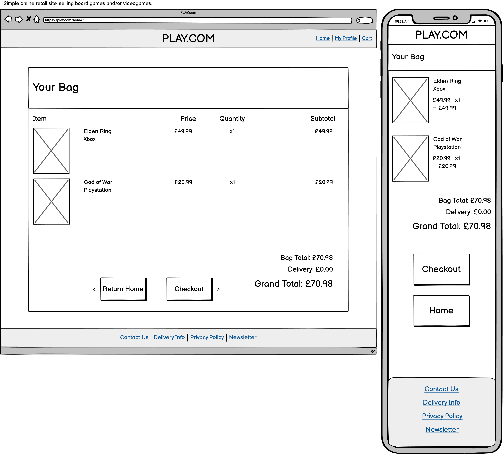

Checkout

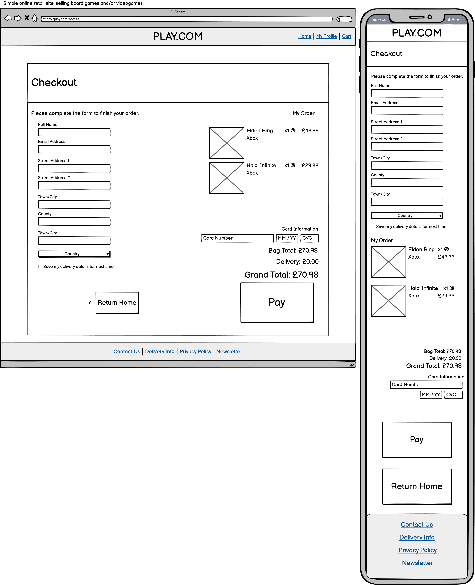

Contact Us

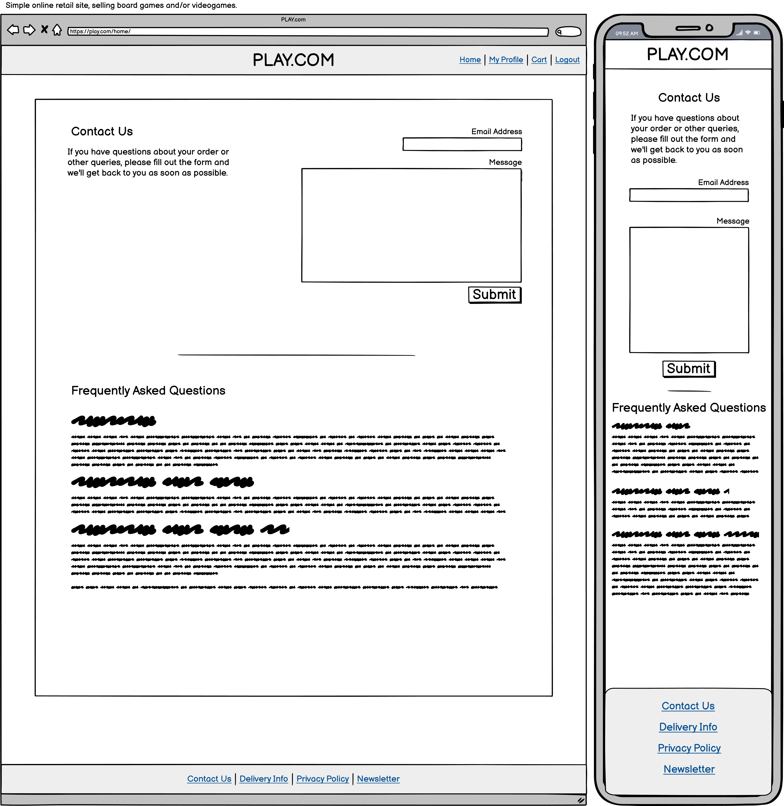

Profile

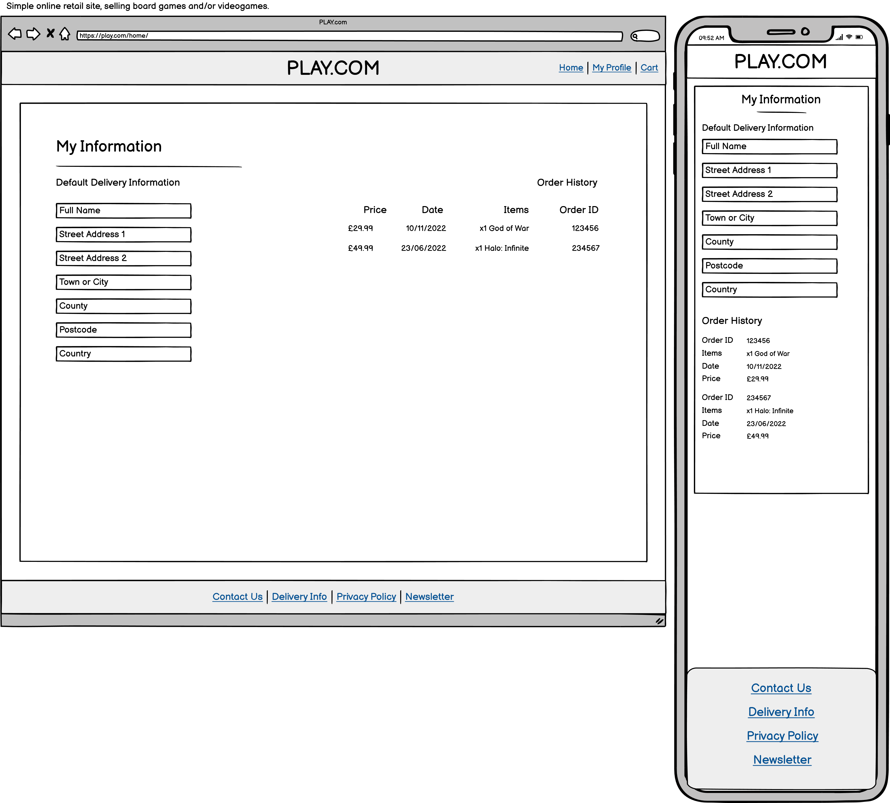

Model Planning

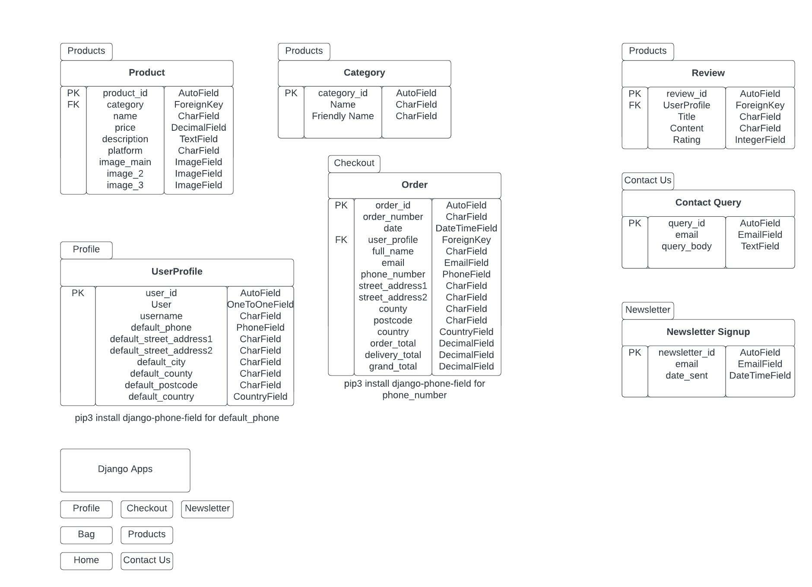

User Stories

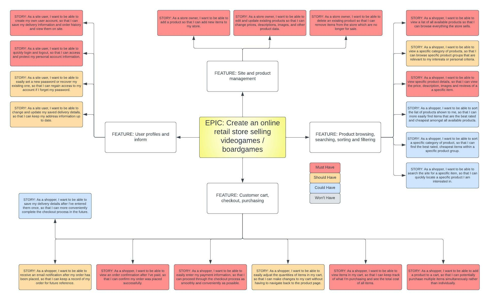

## Technologies Used

### Languages & Frameworks

- HTML
- CSS
- Javascript
- Python
- Django

### Libraries & Tools

- [PLACEHOLDER_TEXT]() was used to PLACEHOLDER_TEXT

##### Back to [top](#table-of-contents)

--- 

## Features

### Navigation Bar
- Consistent across all pages, the navigation bar is setup in the base.html template, which all other templates extend.
- Contains links to Home, and:
  - If the user is authenticated:
      - PLACEHOLDER_TEXT
  - If the user is not authenticated:
      - PLACEHOLDER_TEXT

### Home
- PLACEHOLDER_TEXT

Model Planning

### Home
- PLACEHOLDER_TEXT

### Browse
- PLACEHOLDER_TEXT

### Product Detail
- PLACEHOLDER_TEXT

### Bag
- PLACEHOLDER_TEXT

### Checkout
- PLACEHOLDER_TEXT

### Checkout Success
- PLACEHOLDER_TEXT

#### Sign-in

#### Sign-out

#### Sign-up

### Footer
- Basic footer, setup in the base.html template, and appears at the bottom of each page. 

### Feedback messages
- The user receives a pop-up message when...

##### Back to [top](#table-of-contents)

---

## Validation

The [W3C Validator](https://validator.w3.org/nu/) PLACEHOLDER_TEXT

Home

Sign-in

Sign-out

Sign-up

Browse

Browse (Filtered)

Product Detail

Bag

Checkout

Checkout Success

### CSS Validation
The [Jigsaw CSS validator](https://jigsaw.w3.org/css-validator/) PLACEHOLDER_TEXT

### JavaScript Validation
[JSHint](https://jshint.com/) PLACEHOLDER_TEXT

### PEP8 Validation
[PEP8 Online](http://pep8online.com/) PLACEHOLDER_TEXT

settings.py

##### Back to [top](#table-of-contents)

---

## Testing

PLACEHOLDER_TEXT

##### Back to [top](#table-of-contents)

---

## Bugs

1. UNRESOLVED - 

##### Back to [top](#table-of-contents)

---

## Configuration

### Heroku Deployment
This application has been deployed from GitHub to Heroku by following the steps:

1. Create or log in to your account at [heroku.com](https://heroku.com)
2. Create a new app, choose a unique app name for your app, and select your region.
3. Click "Create app".
4. Under the resources tab, type "postgres", and add a Postgres database to the app (a "Hobby" plan was used for this app).
5. Install the plugins dj-database-url and psycopg2-binary from the CLI in your workspace.
6. Install django and gunicorn from the CLI in your workspace.
7. Use the terminal command "pip3 freeze --local > requirements.txt" to generate your requirements.txt file, required for Heroku deployment.
8. Create a Procfile in your app and enter the following, replacing PROJECT_NAME with your app name: 
   (web: gunicorn PROJECT_NAME.wsgi)
9.  Ensure that your settings.py file is connected to your new Postgres database from Heroku.
10. In settings.py, check that Debug = False.
11. Under the "ALLOWED_HOSTS" variable in settings.py, make sure that 'localhost' and the deployed Heroku root url are included. 
12. Go to Settings in your Heroku and set the environment variables in the Config Vars
    
13. Remove DISABLE_COLLECTSTATIC from Heroku settings.
14. Push the code to Heroku using the command "git push heroku main" from your CLI.

Final steps:

- PLACEHOLDER_TEXT

### Forking the GitHub Repository
1. Go to the GitHub repository
2. Click on the fork icon in top right corner
3. You will then have am identical copy of that repository.
   

##### Back to [top](#table-of-contents)

---

## Credits

- Some parts of this project includes code originally shown in Chris Zielinski's ['Boutique Ado'](https://github.com/ckz8780/boutique_ado_v1/tree/50af34fe6cacbb53181e58860f2dc21fd313950e) walkthrough project. Where relevant, changes have been made to the original code to fit the purposes of this project. However in some cases, no changes have been required in the code to achieve the required functionality. These blocks have been commented against to indicate that they have been carried across and adapated for use in this project. 

- [TEST](https://google.com/) for ...

##### Back to [top](#table-of-contents)