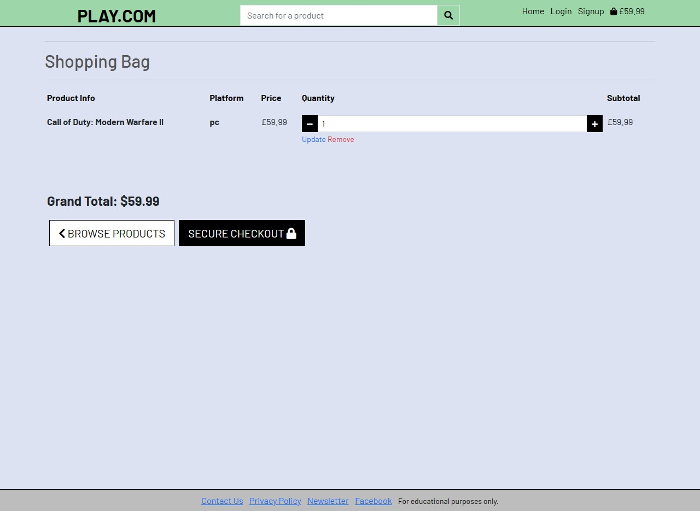
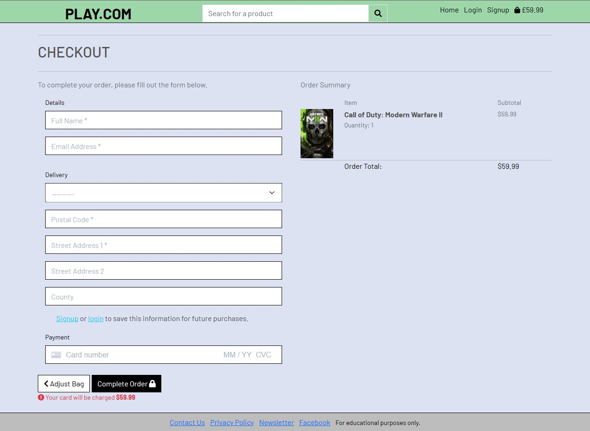
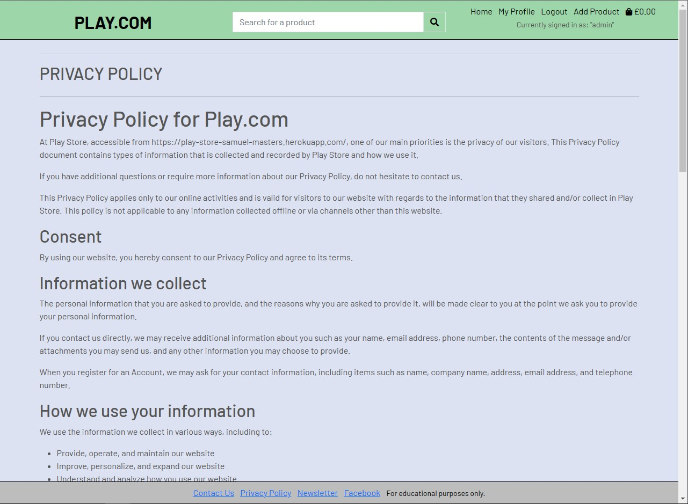
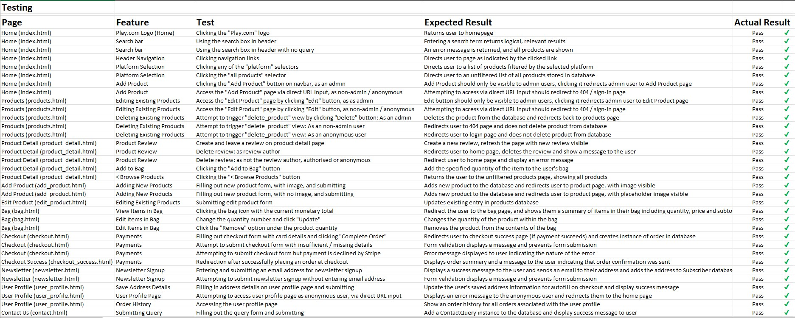

# Play.com - eCommerce Store

**Developer: Samuel Masters**

💻 [Visit live website](https://play-store-samuel-masters.herokuapp.com/)

## Table of Contents
  - [About](#about)
  - [User Goals](#user-goals)
  - [Site Owner Goals](#site-owner-goals)
  - [User Experience](#user-experience)
  - [User Stories](#user-stories)
  - [Design](#design)
    - [Colours](#colours)
    - [Fonts](#fonts)
    - [Structure](#structure)
      - [Website pages](#website-pages)
      - [Database](#database)
    - [Wireframes](#wireframes)
  - [Technologies Used](#technologies-used)
  - [Features](#features)
  - [Validation](#validation)
  - [Testing](#testing)
  - [Bugs](#bugs)
  - [Configuration](#configuration)
    - [Heroku Deployment](#heroku-deployment)
  - [Credits](#credits)

### About

This project, "play-store", is an eCommerce web application where users can browse video game and board game products, add them to a basket, and purchase them via Stripe payments. Users are also able to sign up to a "dummy" newsletter, and can submit contact queries. Site owners / admin have full CRUD functionality with the products listed on the site, and can add, edit, and delete products from the front-end. 

---

## Business Model

Play-Store is a B2C business (business to customer) eCommerce site specialising in the sale of video games and board games, intended for educational purposes only. It includes a mockup Facebook page, which in a real business scenario, would serve to help build brand awareness and reach, as well as SEO practises to help improve the site's visiblity on search engines such as Google. 

### Marketing Strategy
Play-Store utilises two main features as part of it's marketing strategy; a Facebook business page, and a newsletter.

##### Facebook Business Page
The Facebook business page offers an avenue for the business to more directly interact with customers on an individual basis. By having a Facebook business page, the business can provide updates to customers that might be considered 'spammy' or unnecessary if they were communicated via a newsletter or other direct email. In other words, the page allows the business a way to communicate with customers without requiring a specific reason. That said, the page can be used in that manner if required, for example if a customer comments on a post stating they had an issue or query, they can be redirected to a private message for individual customer service or their query can be answered publicly with another comment, which then demonstrates good customer service to everyone who views the page; they can see that the business engages with it's customers. 

Apart from customer engagement, the page improves the site's visiblity as it can be visible to a very large audience of social media users, and it takes advantage of social media networking algorithms as well. For example, if a customer has liked the business' page, then that like can be shown to the user's friends, who in turn might share that interest and explore the page for themselves. 

Facebook Business Mockup

##### Newsletter
The newsletter allows the business to easily send mass communication out to customers who are more likely to take advantage of provided discounts and other promotions. Since the newsletter requires the user to opt-in, it means that those who have opted-in have specifically made the decision to allow contact between themselves and the business, which a one-time customer or browsing user is unlikely to do. The newsletter also offers a way for the business to quickly and easily send out mass communication to this section of it's customer base. One example of how the newsletter might be incentivised is by offering exclusive discount codes to subscribers, which could help build the number of newsletter subscribers as well as improve conversion rates and sales as a whole.

### Search Engine Optimisation (SEO)
The site makes use of meta tags to increase searchability, by including keywords relevant to the site's content and intended audience such as 'video games', 'games', 'store', 'gaming', and more. 

It also includes the 'robots.txt' and 'sitemap.xml' files. The sitemap file is useful for SEO because it helps search engines crawl every important page on your site, and the robots.txt file tells search engines where they're not allowed to go - having this file present within the web application is viewed as a sign of quality by search engines, which in turn improves the site's SEO too. 

---

## User Goals

- Be able to browse the site to look for products I may be interested in purchasing. 
- Be able to easily purchase those products. 
- Be able to read and leave reviews for others to see to help get or provide opinions on a product.

### Site Owner Goals

- Be able to easily create new products to list on the store. 
- Be able to easily edit or delete existing products from the store. 

---

## User Experience

### Target Audience

- People of all ages who have an interest in gaming, or those who are interested in purchasing gaming products for someone else. 

### User Requirements and Expectations

- Simple, easily understandable navigation
- Full CRUD functionality

##### Back to [top](#table-of-contents)

---

## User Stories

User stories were created at project start and were arranged planned out using Lucidchart. They were then copied over into Github Issues and setup on a project board with MoSCoW prioritisation labels applied. 

User Story Planning

GitHub Issues

### Users / Shoppers

1. As a site user, I can create my own user account so that I can save my delivery information and order history and view them on site. (**Must Have**)
2. As a site user, I can quickly login and logout so that I can access and protect my personal account information. (**Must Have**)
3. As a site user, I can easily set a new password or recover an existing one so that I can regain access to my account if I forget my password. (**Could Have**)
4. As a site user, I can edit and update my saved delivery details so that I can keep my address information up to date. (**Could Have**)
5. As a shopper, I can save my delivery details at checkout so that I can more conveniently complete the checkout process in the future. (**Could Have**)
6. As a shopper, I can view an order confirmation after I've paid so that I can confirm my order was placed successfully. (**Must Have**)
7. As a shopper, I can easily enter my payment information so that I can proceed through the checkout process as smoothly and conveniently as possible. (**Must Have**)
8. As a shopper, I can easily adjust the quantities of items in my cart so that I can make changes to my cart without having to navigate back to the product page. (**Should Have**)
9. As a shopper, I can view items in my cart so that I can keep track of what I'm purchasing and see the total cost of all items I've added to my bag. (**Must Have**)
10. As a shopper, I can add a product to my bag so that I have the option to purchase multiple items simultaneously rather than individually. (**Must Have**)
11. As a shopper, I can search the site for a specific item so that I can quickly locate a specific product I'm interested in. (**Should Have**)
12. As a shopper, I can sort a specific category of product so that I can find the best rated and/or cheapest items within a specific product group. (**Could Have**)
13. As a shopper, I can filter the list of available products so that avoid browsing items in categories I'm not interested in. (**Could Have**)
14. As a shopper, I can view specific product details so that I can understand and see specific, relevant product details such as price, description, images and reviews. (**Must Have**)
15. As a shopper, I can view a list of every available product so that I can browse the entire website's selection of products at once.(**Won't Have**)

### Site Owner
16. As a store owner, I can delete existing products so that I can remove items from the store which are no longer for sale. (**Must Have**)
17. As a store owner, I can edit and update existing products so that I can change their prices, descriptions, images and other product data. (**Must Have**)
18. As a store owner, I can create new products so that add new items to sell on the website. (**Must Have**)

##### Back to [top](#table-of-contents)

---

## Design

### Colours

The colour scheme uses light, mild colouring to help provide contrast against the dark text used on the site. 

### Fonts

Google Fonts was used to provide the font for the website. [Barlow](https://fonts.google.com/specimen/Barlow?preview.text=Your%20one%20stop%20shop%20for%20the%20best%20deals.&preview.text_type=custom) was chosen for it's simplicity and clean lines.

### Structure

#### Website Pages

The website uses different templates / pages to comprise it's structure.

The top of each page features a simple navbar showing the site's "Play.com" logo (which also acts as a home button), along with dynamic authentication links which change depending on whether or not the user is logged in. Also included are links to a profile page, which shows an authenticated user their saved delivery information (if they have any) as well as a basic order history which they can interact with to view past order confirmations. Finally, a bag icon is included which dynamically changes to show the current total value of items a user has in their bag, and clicking this icon leads a user towards checkout. 

The bottom of each page features a simple footer with multiple links. 
- "Contact Us" takes the user to a page where they can fill in a form to send a general query to the site admin. 
- "Privacy Policy" takes the user to a page where the application's privacy policy is detailed in full.
- "Newsletter" takes the user to a page where they can enter their email address to signup to a newsletter (an real email is sent upon submitting here).
- "Facebook" is a dummy social media link which opens Facebook's home page in another tab, but in a real eCommerce application, this would point to the site's business page.

- The website consists of the following sections:
  - Products
  - Product Detail
  - Bag
  - Checkout
  - Authentication (Sign In, Signup, Sign Out)

#### Database

Data for this project is stored is an ElephantSQL postgres database. Data models were planned in advance using Lucidchart. Final implementation of the application's models differ from the initial plans shown here, however the process of planning which models might be required and how they might be comprised was helpful in the initial setup stages.

Model Planning

The following models were setup for this project:

##### Order Model
- This model contains information about an individual order placed successfully on site.
- It contains the following fields:
  - order_number
  - user_profile (ForeignKey association to UserProfile model)
  - date
  - full_name
  - email
  - phone_number
  - street_address1
  - street_address2
  - county
  - postcode
  - country
  - order_total

##### OrderLineItem
- This model represents a single item within an instance of the order model.
- It contains the following fields:
  - order (ForeignKey association to Order model)
  - product (ForeignKey association to Product model)
  - quantity
  - lineitem_total

##### ContactQuery
- This model represents a submitted user query from the Contact Us page.
- It contains the following fields:
  - subject
  - first_name
  - last_name
  - email
  - date
  - query_body

##### Subscriber
- This model represents any user who has provided an email address to the newsletter signup page.
- It contains the following fields:
  - email
  - confirmation_key
  - consent
  - signup_date

##### Category
- This model represents different potential product types for which products may be associated against. 
- It contains the following fields:
  - category_name
  - friendly_name

##### Product
- This model represents an item to be listed and available for purchase on the site.
- It contains the following fields:
  - category (ForeignKey association to Category)
  - name
  - price
  - description
  - platform
  - image_main
  - image_2
  - image_3

##### ProductReview
- This model represents a user-submitted review of an item on site.
- It contains the following fields:
  - product (ForeignKey association to Product)
  - reviewer (ForeignKey association to User, a Django authentication model)
  - review_title
  - review_body
  - rating
  - date

##### UserProfile
- This model represents a user's saved information.
- It contains the following fields:
  - user (OneToOne association with User, a Django authentication model)
  - default_full_name
  - default_street_address1
  - default_street_address2
  - default_postcode
  - default_county
  - default_country

---

### Wireframes

Home

Browse

Product Detail

Bag

Checkout

Contact Us

Profile

Model Planning

User Stories

---

## Technologies Used

### Languages & Frameworks

- HTML
- CSS
- Javascript
- Python
- Django

### Libraries & Tools

- [Am I Responsive](https://ui.dev/amiresponsive) was used to create the example image at the top of this README.
- [Balsamiq](https://balsamiq.com/) was used to setup visual wireframes for the website's pages.
- [Lucidchart](https://www.lucidchart.com/pages/) was used to create wireframes of the project's anticipated data models and user stories.
- [Bootstrap](https://getbootstrap.com/) was used as a framework for the project.
- [Django-allauth](https://django-allauth.readthedocs.io/en/latest/index.html) was used to add simple user authentication to the website.
- [GitHub](https://github.com/) was used for version control and development hosting.
- [Google Fonts](https://fonts.google.com/) was used for the project's fonts.
- [Heroku](https://id.heroku.com/login) was used to deploy the live production version of the site.
- [Elephant SQL](https://www.elephantsql.com/) was used to provide a postgres database to store the deployed site's data.
- [Stripe](https://stripe.com/gb) was used to setup and handle payments made through the website.
- [Amazon AWS](https://aws.amazon.com/) was used to store the deployed project's static files and media.

##### Back to [top](#table-of-contents)

--- 

## Features

### Navigation Bar
- The navigation bar was setup in the base.html template, which all other pages extend from. This means that the header is the same across all pages.  
- Contains links to Home, and:
  - If the user is authenticated:
      - My Profile, leads the user to their profile page
      - Logout, leads the user to an authentication page where they can sign out
      - Add Product (visible to authenicated users but only allows superusers), leads superusers to a page where they can create new products from a form
      - Shopping bag icon, leads the user to a bag summary page which then itself leads to checkout
  - If the user is not authenticated:
      - Login, leads the user to an authentication page where they can sign in
      - Signup, leads the user to an authentication page where they can create a new account
      - Shopping bag icon, leads the user to a bag summary page which then itself leads to checkout

### Home
- This is the front-page of the site. It contains links to filtered product lists which the user can browse. It was originally intended to have a front-page image with a carousel, however this could not be implemented before submission. 
- Clicking the platform selectors bring the user to a page with a list of products pertaining to the platform they selected. 

Example

### Products
- This page displays a list of products according to the platform selector that the user clicked on from the home page. 
- It was intended to have a 'tile'-like design, by looping through the list of products and creating a 'tile' for each one with details such as the main image, name of the product and price. 

Example

### Product Detail
- This page displays a specific product in more detail. It includes space for some marketing copy to describe the product, as well as a space for user reviews further down and a brief section about the returns policy.

Example

### Bag
- This page shows a user what the contents of their virtual bag are. 

Example

### Checkout
- This page allows a user to fill out a form to proceed through the checkout process and confirm their purchase. 

Example

### Checkout Success
- This page shows a user their order confirmation after successfully checking out.

Example

### User Profile
- This page shows an authenticated user their saved delivery details and order history.

Example

### Add Product
- This page shows an authenticated superuser a form which they can fill in to add new products to the database.

Example

### Contact Us
- This page shows a user a form which they can fill in to submit a query to the site admin.

Example

### Newsletter
- This page shows an input field where a user can enter an email address they wish to add to the site's mailing list. Submitting an email address here sends a real email to the provided address.

Example

### Privacy Policy
- This page shows the site's privacy policy.

Example

### Sign-in
- This page shows a user a form where they can enter their details to sign-in, if they have already made an account.

Example

### Sign-out
- This page shows an authenticated user where they can signout of their account.

Example

### Sign-up
- This page shows a user where they can create a new account.

Example

### Feedback messages
- The user receives a pop-up message when performing various actions. The pop-up message disappears after around 5 seconds, and can be manually dismissed by the user before then. 

Success Message

Info Message

##### Back to [top](#table-of-contents)

---

## Validation

The [W3C Validator](https://validator.w3.org/nu/) was used to validate the HTML files used in this project.

Home

Products

Product Details

Bag

Checkout

Checkout Success

User Profile

Add Product

Contact Us

Newsletter

Privacy Policy

### CSS Validation
The [Jigsaw CSS validator](https://jigsaw.w3.org/css-validator/) was used to validate the CSS files in the project. CSS had to be validated via direct input, as attempting to validate via URL caused parsing errors due to the included Bootstrap style sheets 

**!!!SCRAP AND REWRITE THIS!!!**

Attempting validation via URL

Attempting validation via direct input

Direct input validation result

### JavaScript Validation
[JSHint](https://jshint.com/) was used to validate the JS files in the project.

script.js

The validator shows an unused variable here, however this script was largely adapated from the toast script used in the Boutique Ado project as it was fit-for-purpose for this project. Therefore the file was unchanged in this project's implementation of toasts. 

stripe_elements.js

### PEP8 Validation
[Code Institute's Python Linter](https://pep8ci.herokuapp.com/) was used to validate the Python files in the project. Screenshots of the results of each relevant file - that is, files which had code written into them and were actively modified and utilised - are shown below. Results are broken apart into each Django app used within the project. 

#### Bag

urls.py

views.py

contexts.py

---

#### Checkout

admin.py

models.py

urls.py

views.py

forms.py

webhook_handler.py

webhooks.py

signals.py

---

#### Contact

admin.py

models.py

urls.py

views.py

forms.py

---

#### Home

urls.py

views.py

---

#### Newsletter

admin.py

models.py

urls.py

views.py

forms.py

---

#### Play_Store (core project app)

urls.py

views.py

settings.py

---

#### Reviews

admin.py

models.py

urls.py

views.py

forms.py

---

#### User_Profiles

models.py

urls.py

views.py

forms.py

---

#### Products

admin.py

models.py

urls.py

views.py

forms.py

##### Back to [top](#table-of-contents)

---

## Testing

Automated testing was not used for this project. Features were tested manually by proceeding through the customer journey and debugging errors or other unintended behaviours as they occurred throughout that journey. 

The approach adopted for this project's manual testing was to visit each page in turn and document each potential user interaction. The interaction was documented, along with the expected behaviour from that interaction. When each expected behaviour was confirmed, it was marked with a 'Passed' tag. When tests did not intially pass, the code base was reviewed to determine the cause and changes were made to enable the test to pass. This tracking was initially done within a regular Excel document, a screenshot of which is visible below: 

Manual Testing Checklist

A full list of the manual tests carried out are also detailed here: 

Page | Feature | Test  | Expected Result | Result |
|----| --------| ----- | --------------- | :-----------: |
| Home (index.html) | Play.com Logo (Home)  | Clicking the "Play.com" logo | Returns user to homepage | Passed |
| Home (index.html) | Search bar  | Using the search box in header | Entering a search term returns logical, relevant results | Passed |
| Home (index.html) | Search bar  | Using the search box in header with no query | An error message is returned, and all products are shown | Passed |
| Home (index.html) | Header Navigation  | Clicking navigation links | Directs user to page as indicated by the clicked link | Passed |
| Home (index.html) | Platform Selection  | Clicking any of the "platform" selectors | Directs user to a list of products filtered by the selected platform | Passed |
| Home (index.html) | Platform Selection  | Clicking the "all products" selector | Directs user to an unfiltered list of all products stored in database | Passed |
| Home (index.html) | Add Product  | Clicking the "Add Product" button on navbar, as an admin | Add Product should only be visible to admin users, clicking it redirects admin user to Add Product page | Passed |
| Home (index.html) | Add Product  | Access the "Add Product" page via direct URL input, as non-admin / anonymous | Attempting to access via direct URL input should redirect to 404 / sign-in page | Passed |
| Products (products.html) | Editing Existing Products | Access the "Edit Product" page by clicking "Edit" button, as as admin | Edit button should only be visible to admin users, clicking it redirects admin user to Edit Product page | Passed |
| Products (products.html) | Editing Existing Products | Access the "Edit Product" page by clicking "Edit" button, as non-admin / anonymous | Attempting to access via direct URL input should redirect to 404 / sign-in page | Passed |
| Products (products.html) | Deleting Existing Products | Attempt to trigger "delete_product" view by clicking "Delete" button: As an admin | Deletes the product from the database and redirects back to products page | Passed |
| Products (products.html) | Deleting Existing Products | Attempt to trigger "delete_product" view: As an non-admin user | Redirects user to 404 page and does not delete product from database | Passed |
| Products (products.html) | Deleting Existing Products | Attempt to trigger "delete_product" view: As an anonymous user | Redirects user to login page and does not delete product from database | Passed |
| Product Detail (product_detail.html) | Product Review | Create and leave a review on product detail page | Create a new review, refresh the page with new review visible | Passed |
| Product Detail (product_detail.html) | Product Review | Delete review: as review author | Redirects user to home page, deletes the review and show a message to the user | Passed |
| Product Detail (product_detail.html) | Product Review | Delete review: as not the review author, authorised or anonymous | Redirect user to home page and display an error message | Passed |
| Product Detail (product_detail.html) | Add to Bag | Clicking the "Add to Bag" button | Add the specified quantity of the item to the user's bag | Passed |
| Product Detail (product_detail.html) | Browse Products | Clicking the "< Browse Products" button | Returns the user to the unfiltered products page, showing all products | Passed |
| Add Product (add_product.html) | Adding New Products | Filling out new product form, with image, and submitting | Adds new product to the database and redirects user to product page, with image visible | Passed |
| Add Product (add_product.html) | Adding New Products | Filling out new product form, with no image, and submitting | Adds new product to the database and redirects user to product page, with placeholder image visible | Passed |
| Edit Product (edit_product.html) | Editing Existing Products | Submitting edit product form | Updates existing entry in products database | Passed |
| Bag (bag.html) | View Items in Bag | Clicking the bag icon with the current monetary total | Redirect the user to the bag page, and shows them a summary of items in their bag including quantity, price and subtotal | Passed |
| Bag (bag.html) | Edit Items in Bag | Change the quantity number and click "Update" | Changes the quantity of the product within the bag | Passed |
| Bag (bag.html) | Edit Items in Bag | Click the "Remove" option under the product quantity | Removes the product from the contents of the bag | Passed |
| Checkout (checkout.html) | Payments | Filling out checkout form with card details and clicking "Complete Order" | Redirects user to checkout success page (if payment succeeds) and creates instance of order in database | Passed |
| Checkout (checkout.html) | Payments | Attempt to submit checkout form with insufficient / missing details | Form validation displays a message and prevents form submission | Passed |
| Checkout (checkout.html) | Payments | Attempting to submit checkout form but payment is declined by Stripe | Error message displayed to user indicating the nature of the error | Passed |
| Checkout Success (checkout_success.html) | Payments | Redirection after successfully placing an order at checkout | Displays order summary and a message to the user indicating that order confirmation was sent | Passed |
| Newsletter (newsletter.html) | Newsletter Signup | Entering and submitting an email address for newsletter signup | Displays a success message to the user and sends an email to their address and adds the address to Subscriber database | Passed |
| Newsletter (newsletter.html) | Newsletter Signup | Attempting to submit newsletter signup without entering email address | Form validation displays a message and prevents form submission | Passed |
| User Profile (user_profile.html) | Save Address Details | Filling in address details on user profile page and submitting | Update the user's saved address information for autofill on checkout and display success message | Passed |
| User Profile (user_profile.html) | User Profile Page | Attempting to access user profile page as anonymous user, via direct URL input | Displays an error message to the anonymous user and redirects them to the home page | Passed |
| User Profile (user_profile.html) | Order History | Accessing the user profile page | Show an order history for all orders associated with the user profile | Passed |
| Contact Us (contact.html) | Submitting Query | Filling out the query form and submitting | Add a ContactQuery instance to the database and display success message to user | Passed |

##### Back to [top](#table-of-contents)

---

## Bugs

1. UNRESOLVED - Validation emails sent to users who signed up for a newsletter contained links which, when clicked, were meant to affect their instance of the Subscriber model by confirming their "confirmation key". However this does not work yet as there were issues with attaching the confirmation key to the Subscriber instance newly created when the user submits the form. 
2. RESOLVED - When toasts were first implemented they did not dismiss, and were 'stuck' on the screen. After some research, a fellow student had encountered a similar issue and provided a block of JavaScript which fixed the issue. Richard Ash is incldued in the credits below for this fix. 
3. RESOLVED - At one point a redirect loop was identified when authorised non-superusers attempted to access restricted URLs which were protected with a decorator which tested for superuser permissions. When this happened the page would crash and and browser error message indicating a redirect loop was reported. To resolve this, additional decorators were added to the views that returned these pages in a 'stacking' method. The new decorator first checks for general authentication and specifically redirects anonymous users to the login page, and the original decorator then also checks that the user is a superuser, and redirects them to the site's error page if they are not. 
4. RESOLVED - Saved address information was not populating on the checkout form, even when it already exists on a user's profile. This was resolved by adding an additional code block to retrieve this information and by removing a field in the UserProfile model which had turned out to be obsolete. These changes made in the checkout view enabled the autofill functionality to work as intended. 
5. RESOLVED - When attempting to create an item without adding an image, the deployed project returned a 500 error when attempting to load the new product's detail page. The issue was believed to be due to a misconfiguration of the static reference for the relevant placeholder image stored within Amazon Web Services' S3 bucket. To resolve this, the reference used on the image tag was replaced with an absolute URL pointing to the exact placeholder image intended. This change meant that the page rendered correctly, with the placeholder showing as intended. 

##### Back to [top](#table-of-contents)

---

## Configuration

### Heroku Deployment
This application has been deployed from GitHub to Heroku by following the steps:

1. Create or log in to your account at [heroku.com](https://heroku.com)
2. Create a new app, choose a unique app name for your app, and select your region.
3. Click "Create app".
4. Under the resources tab, type "postgres", and add a Postgres database to the app (a "Hobby" plan was used for this app).
5. Install the plugins dj-database-url and psycopg2-binary from the CLI in your workspace.
6. Install django and gunicorn from the CLI in your workspace.
7. Use the terminal command "pip3 freeze --local > requirements.txt" to generate your requirements.txt file, required for Heroku deployment.
8. Create a Procfile in your app and enter the following, replacing PROJECT_NAME with your app name: 
   (web: gunicorn PROJECT_NAME.wsgi)
9.  Ensure that your settings.py file is connected to your new Postgres database from Heroku.
10. In settings.py, check that Debug = False.
11. Under the "ALLOWED_HOSTS" variable in settings.py, make sure that 'localhost' and the deployed Heroku root url are included. 
12. Go to Settings in your Heroku and set the environment variables in the Config Vars.
13. Remove DISABLE_COLLECTSTATIC from Heroku settings.
14. Push the code to Heroku using the command "git push heroku main" from your CLI.

### Forking the GitHub Repository
1. Go to the GitHub repository
2. Click on the fork icon in top right corner
3. You will then have am identical copy of that repository.
   

##### Back to [top](#table-of-contents)

---

## Credits

- Some parts of this project includes code originally shown in Chris Zielinski's ['Boutique Ado'](https://github.com/ckz8780/boutique_ado_v1/tree/50af34fe6cacbb53181e58860f2dc21fd313950e) walkthrough project. Where relevant, changes have been made to the original code to fit the purposes of this project. However in some cases, no changes have been required in the code to achieve the required functionality. These blocks have been commented against to indicate that they have been carried across and adapated for use in this project. 
- [Devsheet.com](https://devsheet.com/code-snippet/allow-or-limit-a-view-to-superuser-only-django/) helped me understand how to limit a view to a superuser only.
- [Richard Ash's solution](https://code-institute-room.slack.com/archives/C7HS3U3AP/p1633769555244600?thread_ts=1633696310.225500&cid=C7HS3U3AP) resolved an issue I was having with toasts in this project.
- [Ordinary Coders](https://ordinarycoders.com/blog/article/build-a-django-contact-form-with-email-backend) provided a useful tutorial which helped me to create a contact form. 
- [Twilio.com](https://www.twilio.com/blog/build-email-newsletter-django-twilio-sendgrid) was used in the project to handle the sending of emails for order confirmations, newsletter signups and new user email validation. Additionally, information provided by Twilio helped provide insights on how one might configure an email newsletter.
- [Termly](https://termly.io/) was used to generate a returns policy that was then used on the product detail pages.

##### Back to [top](#table-of-contents)